# 2022-12-03

## Computer System chapter9

### 1. 물리 및 가상주소 방식 

- 메인 메모리는 M개의 연속적인 바이트 크기 셀의 배열
- 각 바이트는 고유의 물리 주소(pysical address)를 가짐
- 읽기 명령이 실행되면 유효 물리 주소를 생성하여 메인 메모리에 전달

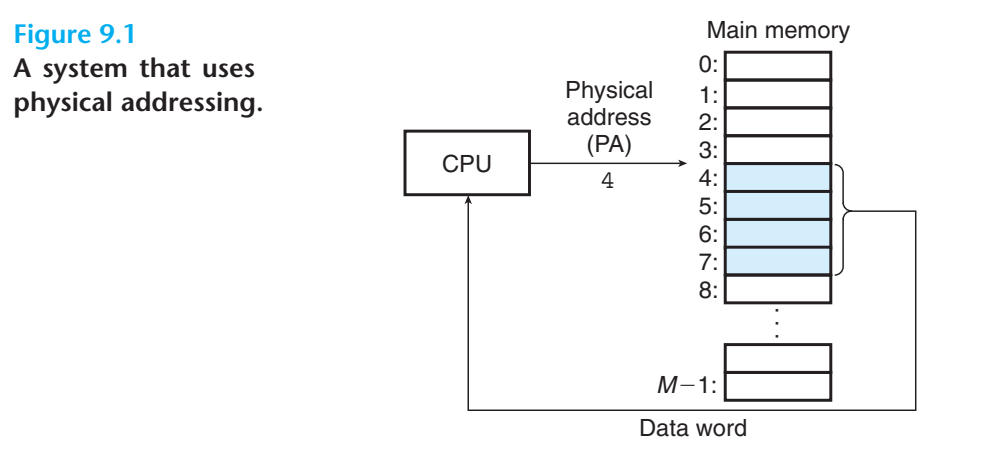

- 대부분의 현대 프로세서에서는 가상 주소(virtual address)를 생성하여 메인 메모리에 접근
- 메모리로 전달되기 전 적절한 물리 주소로 변환(address translation)
- CPU 내에 Memory Management Unit(MMU)라는 전용 하드웨어가 가상 주소를 번역하며
  번역에 활용하는 참조 테이블은 운영체제가 관리

### 2.  주소공간

- ordered set of nonnegative integer addresses
- 연속되면 linear 주소공간
- 주소공간의 크기는 가장 큰 주소를 표시하는 데 필요한 비트 수로 표기
- 현대 시스템은 전형적으로 32비트 or 64비트 가상 주소공간을 지원
- 메인 메모리의 각 바이트는 가상 주소공간으로부터 선택된 가상 주소를 가짐

### 3. 캐싱 도구로서의 VM

- 가상 메모리는 디스크에 저장된 N개의 바이트 크기의 셀 배열로 구성
- 각 바이트는 특정한 가상주소를 가지며 배열의 인덱스로 작용
- 배열 정보는 메인 메모리 안에 캐시되며 **페이지**라고 불리는 블록단위로 분할
  - 물리 메모리 또한 물리 프레임이라고도 불리는 물리 페이지로 분할
- 가상 페이지는 P= 2p바이트의 크기를 가짐
- 가상 페이지의 집합은 시점에 무관하게 세 개의 중첩없는 부분 집합으로 구분
  - Unallocated
    - 할당 자체가 되지 않은 어떠한 디스크 공간도 차지하지 않는 페이지들
  - Allocated
    - 할당은 되었으나 물리 페이지에 대한 캐시 여부가 다른 페이지들
    - Cached
    - Uncached

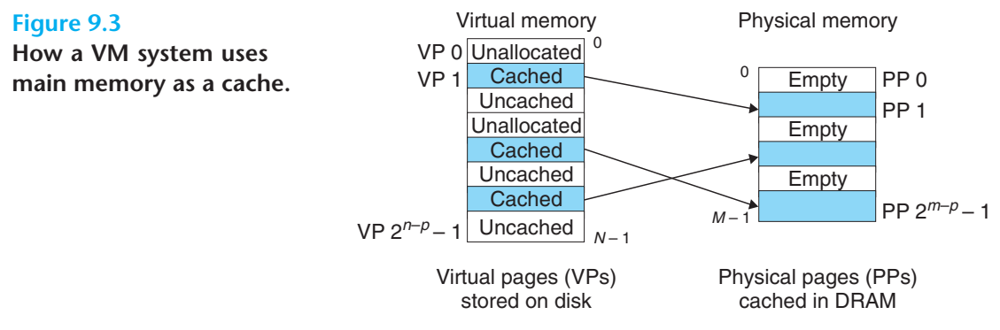

​	### 3.2 페이지 테이블

- VM 시스템에서 가상 페이지가 DRAM의 어느 부분에 캐시되었는 지 결정하기 위한 방법
- 미스가 존재하면 물리 메모리 내에 victim 페이지를 선택하고 교체

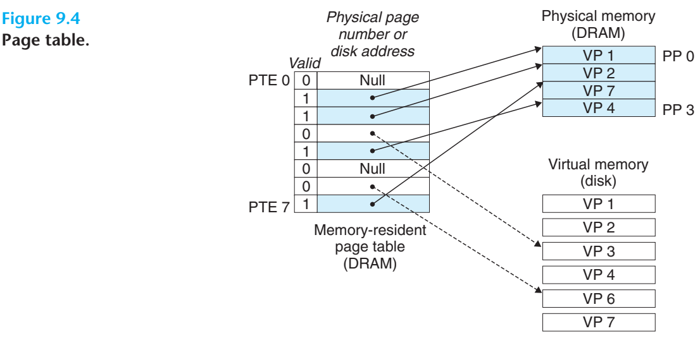

- MMU 내부의 주소 번역기가 VM을 PM으로 변환할 때 페이지 테이블을 참조
- OS가 페이지 테이블의 콘텐츠 관리 및 페이지들의 디스크-DRAM간 이동을 관장
- 페이지 테이블은 page table entries(PTEs) 배열
  - PTE의 유효비트는 DRAM에 할당 여부를 표시
  - 유효비트와 주소 필드로 구성
    - 유효비트가 세팅된 경우
      - 주소필드는 가상 페이지가 캐시되어 대응되는 DRAM 물리 페이지 시작부분을 가리킴
    - 유효비트가 세팅되지 않을 경우
      - NULL 주소는 가상페이지가 할당되지 않음을 나타냄
      - 디스크 상의 가상 페이지 시작 부분을 나타냄

> 완전 결합성(fully associative)
>
> 비어있는 캐시 메모리가 있으면 그냥 마음대로 주소를 저장하는 방식
> 저장 시 크게 알고리즘 비용이 없어 간단
> 읽을 때 모든 블럭을 순회해 데이터가 있는지 검사하는 문제

### 3.3 페이지 적중(Page Hits)

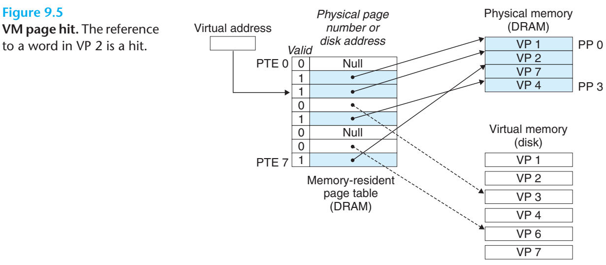

위 그림과 같이 CPU가 DRAM에 캐시된 가상메모리의 VP2 워드를 하나 읽을 때, 하드웨어는 PTE2를 찾기 위해
가상 주소 인덱스를 사용하여 메모리에서 읽음

유효비트가 세팅되었으므로 VP2가 메모리에 캐시된 것을 알고있으므로 PTE 내 물리 메모리 주소를
사용해 해당 워드의 물리 주소를 구성

### 3.4 페이지 오류(Page Faults)

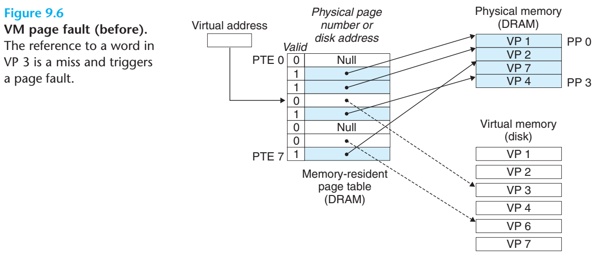

위 그림은 오류 발생 전의 페이지 테이블 상태로 CPU는 DRAM에 캐시되지 않은 VP3내 워드를 참조
유효비트로부터 캐시되지 않음을 유추하여 페이지 오류 예외를 유발

페이지 오류 예외가 핸들러를 호출하게 되고, victim 페이지가 저장된 가상 페이지를 선택 및 변경

변경된 가상 페이지에 대한 PTE를 수정하여 기존의 메모리가 더 이상 캐시되지 않았다는 사실을 반영하고
디스크에서 물리 메모리 페이지로 복사, PTE를 갱신하여 리턴

핸들러가 리턴하면 오류가 발생한 명령을 다시 시작하며, 주소 번역기로 재전송 및 처리

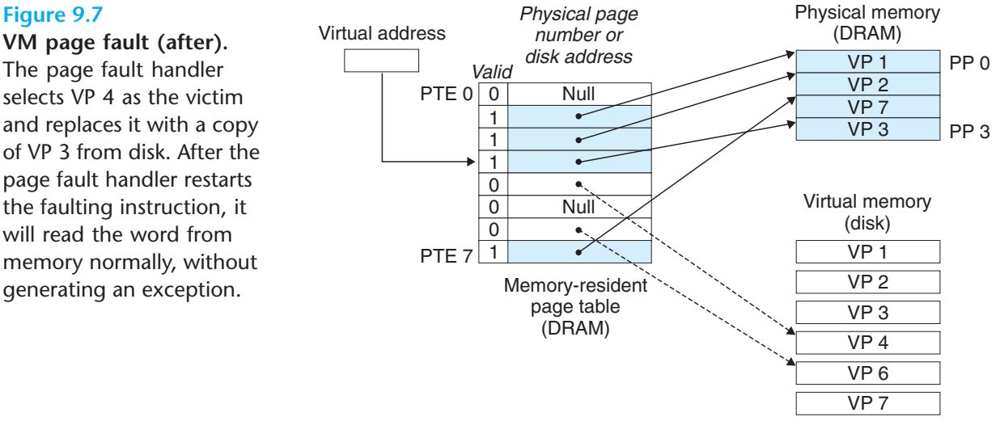

> 가상메모리가 발명된 60년대는 SRAM 캐시를 만들기 훨씬 전으로, 용어에 차이가 있다.
>
> - 페이지: 가상 메모리 상에 존재하는 블록
> - 페이징(=스와핑): 디스크와 메모리 사이에 페이지를 전송하는 동작
>
> 페이지들은 페이징을 통해 디스크와 DRAM을 이동하며 미스가 발생하여
> 다른 페이지가 들어올 때 까지 메모리 상에 존재하는 전략을 demand paging이리고 한다.
>
> 미스를 미리 예측해서 스와핑하는 방법도 가능하지만, 현대의 모든 시스템은 요구 페이징 방식을 사용한다.

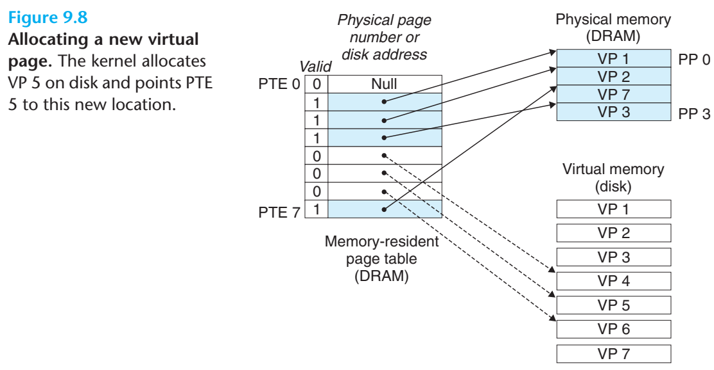

### 3.5 페이지의 할당

- 시스템에서 `malloc`과 같은 함수를 통해 새로운 페이지를 할당하면 디스크 상에 공간을 형성하여
  가상 페이지가 할당되고 PTE가 업데이트 되어 새로 생긴 디스크 상의 페이지를 나타냄

### 3.6 지역성

- 비효율적으로 보이는 문제는 지역성이라는 특징에 의해 설명 가능
- 지역성은 프로그램이 동작 집합(working set) 또는 거주 집합(resident set)이라 알려진 상대적으로
  소규모로 활성화된 페이지의 집합에서 동작하는 경향을 보일 것에 대한 기대
- 만일 동작 집합 크기 자체가 물리 메모리보다 크면 쓰래싱(thrashing)이라는 상황 발생 가능

> 쓰래싱(Thrashing)
>
> 프로세스의 처리 시간보다 페이지 교체 시간이 더 많아지는 현상으로, CPU의 이용률이 급격히 낮아진다.
>
> 프로세스 간의 과도한 메모리 경쟁이나 메모리가 감당할 수 없는 수준의 다중 프로그래밍, 페이지 교체 알고리즘의 비효율적인 동작 등이 원인으로 발생한다.
>
> 이를 해결하기 위해서는 다중 프로그래밍의 정도를 낮추고, working set이 유지될 수 있도록 소프트웨어 동작 구조나 페이지 교체 알고리즘을 개선해야 한다.
> 메모리 용량 자체가 부족하면 CPU 사용율이 급격히 떨어지는 원인이 되기도 한다.

### 4. 메모리 관리 도구로서의 VM

- 초기 시스템에서는 물리 메모리보다 작은 가상 주소공간을 지원함에도 유용한 매커니즘으로 작동
  - 메모리 관리를 단순화
  - 메모리를 보호
- 실제 환경에서 OS는 각 프로세스마다 별도의 페이지 테이블을 제공하여 가상 주소 공간을 별도로 제공

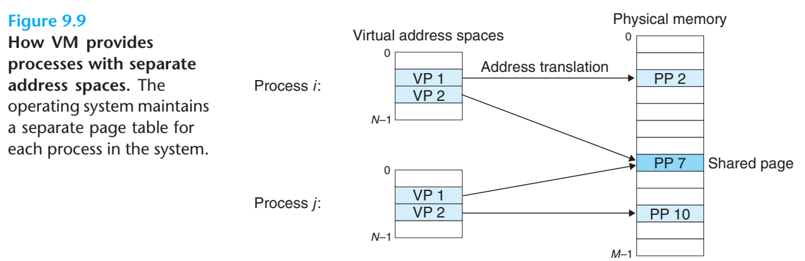

그림과 같이 다수의 가상 페이지들이 동일한 공유된 물리 페이지에 매핑되는 것이 가능

- VM은 linking, loading, 코드와 데이터의 공유, 응용으로의 메모리 할당을 단순화

  - linking

    - 실제로 물리 메모리 내 어디에 위치하는 지 상관없이 동일한 기본 포맷을 사용 가능
    - 코드 세그먼트는 항상 특정 가상 주소에서 시작하고 데이터 세그먼트는
      정 거리를 두고 위치 코드 세그먼트 뒤에 위치
    - 스택은 주소공간 최상위 부분을 차지하여 아래로 쌓임
    - 이러한 통일성이 링커의 설계와 구현을 단순화

  - loading

    - 코드와 데이터 세그먼트를 위한 가상의 페이지를 할당
    - 실제 데이터를 메모리로 전혀 복사하지 않고 참조 위치를 제공

    > 위와 같이 연속된 가상 페이지를 임의 파일 임의 위치로 매핑하는 개념을 메모리 매핑이라 한다.

  - sharing

    - 프로세서별로 공유하지 않는 내용은 중첩되지 않는 페이지 테이블 생성
    - 시스템 콜 등 공유되는 것이 유리한 코드와 데이터의 경우 하나의 사본을 공유할 수 있도록 매핑

  - memory allocation

    - 추가적인 힙 공간등을 요구하는 등의 상황에 연속적인 가상메모리 페이지를 할당하고 **임의의 물리페이지로 매핑**
    - 물리 메모리에서 k개의 연속적인 페이지를 찾을 필요 없이 매핑이 가능

### 5. 메모리 보호 도구로서의 VM

- 사적 메모리에 대하여 명시적으로 허용하지 않은 경우 코드와 데이터 구조들에 대한 보호 필요
- 가상 메모리를 사용하는 것은 다른 프로세서로부터 사적 메모리를 분리
- PTE에 허가 비트를 추가해 주소 번역기에 대한 가상 페이지 내용 접근을 제어

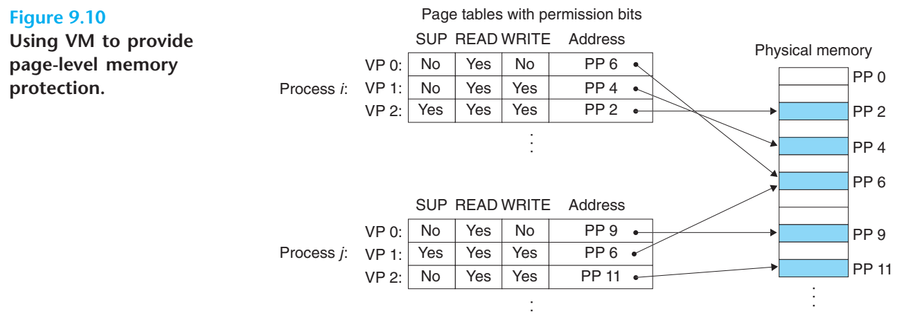

위 그림에서 SUP(superviser)은 관리자 권한을 요구하며 READ와 WRITE 가능 여부를 지정

- 입력된 명령에서 위와 같이 지정된 허가 사항을 위반하면 예외 핸들러로 처리
  - 리눅스 쉘은 이와 같은 예외가 segmentation fault

### 6. 주소의 번역

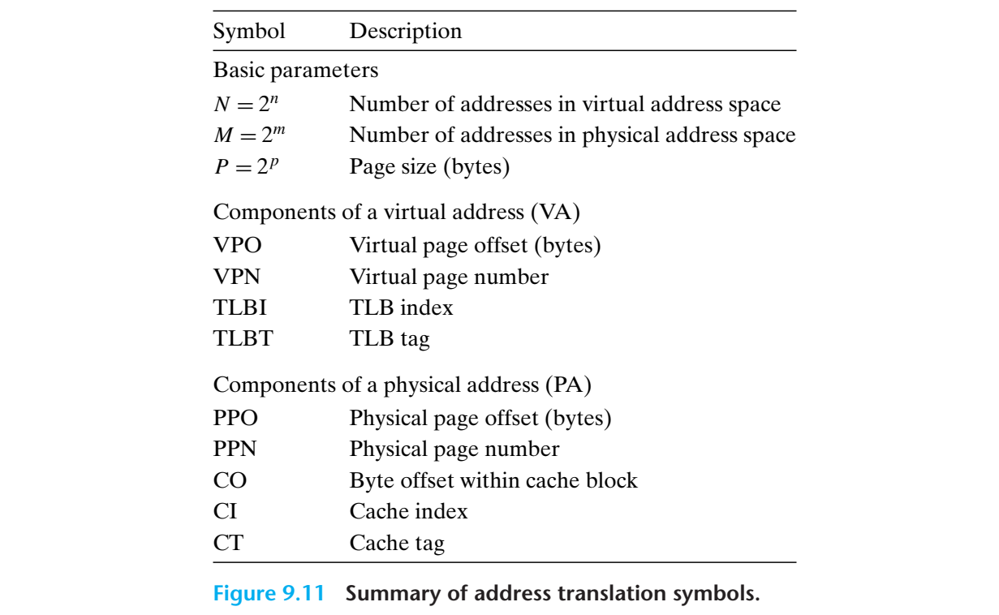

주소 번역에 사용되는 심볼들

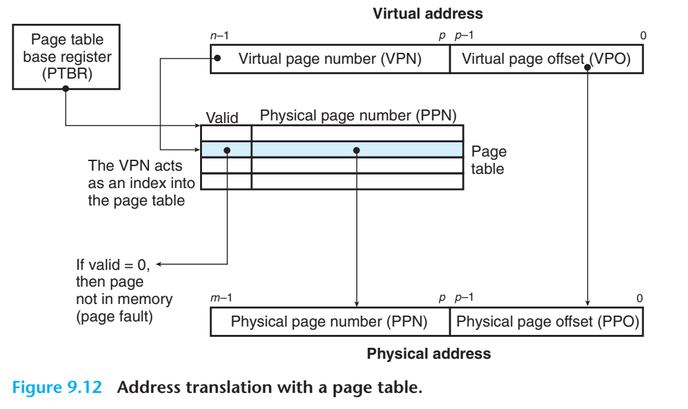

- CPU 내의 제어 레지스터인 page table base register(PTBR)은 현재 페이지 테이블을 가리킴
- n bit의 가상 주소는 두 구성요소를 가짐
  - p-bit virtual page offset(VPO)
  - (n-p)-bit virtual page number(VPN)
    - MMU가 VPN을 사용해 적합한 PTE를 선택
- 대응 물리 주소는 PTE에서 가져온 물리 페이지 번호(PPN)과 VPO를 연결한 것

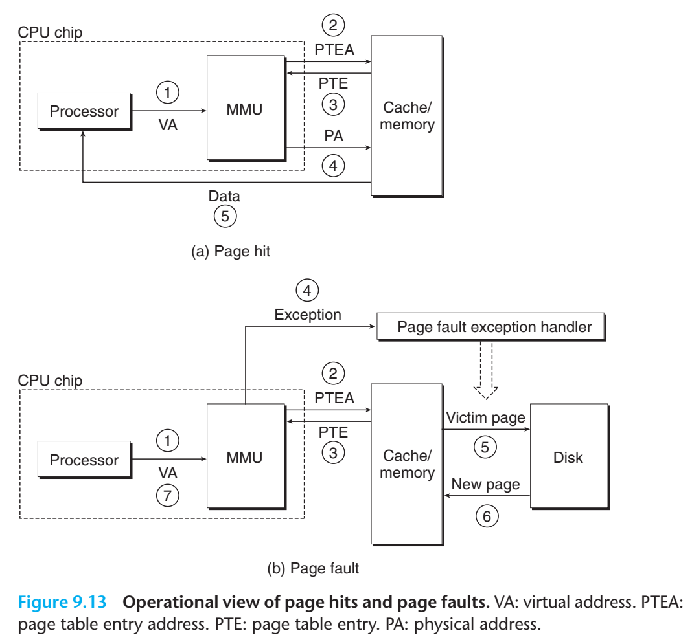

위 그림의 (a)는 CPU에서 page hit가 있을 때 수행하는 단계

> 1. 프로세서가 가상주소를 생성하여 MMU로 전달
> 2. MMU가 PTE Address를 생성하여 캐시/메인 메모리에 요청
> 3. 캐시/메인 메모리는 PTE를 MMU로 리턴
> 4. MMU는 물리 주소를 구성하고 캐시/메인 메모리로 전송
> 5. 캐시/메인 메모리는 요청한 데이터 워드를 프로세서로 전송

그림 (b)는 page fault를 처리하는 것으로 하드웨어와 운영체제 커널의 협력이 필요

> 1~3. (a)와 동일
>
> 4. PTE의 유효비트가 0이므로 MMU에서 예외를 발생시키고
>    CPU내의 제어를 운영체제 커널의 페이지 오류 예외 핸들러로 이동
> 5. victim page를 결정하여 수정되면 디스크로 페이지를 이동
> 6. 새 페이지를 스와핑하고 메모리 내 PTE 갱신
> 7. 처음의 프로세서로 돌아가 명령 재시작
>    CPU는 문제를 일으킨 가상 주소를 다시 MMU로 전송하고 (a)와 같은 방식으로 수행
