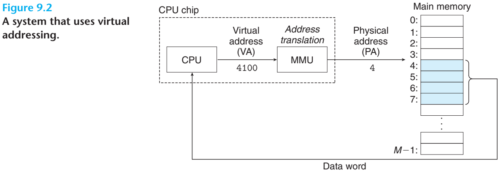

### 2022-12-03

#### Computer System chapter9

##### 1. 물리 및 가상주소 방식 

- 메인 메모리는 M개의 연속적인 바이트 크기 셀의 배열
- 각 바이트는 고유의 물리 주소(pysical address)를 가짐
- 읽기 명령이 실행되면 유효 물리 주소를 생성하여 메인 메모리에 전달

- 대부분의 현대 프로세서에서는 가상 주소(virtual address)를 생성하여 메인 메모리에 접근
- 메모리로 전달되기 전 적절한 물리 주소로 변환(address translation)
- CPU 내에 Memory Management Unit(MMU)라는 전용 하드웨어가 가상 주소를 번역하며
  번역에 활용하는 참조 테이블은 운영체제가 관리

##### 2.  주소공간

- ordered set of nonnegative integer addresses
- 연속되면 linear 주소공간
- 주소공간의 크기는 가장 큰 주소를 표시하는 데 필요한 비트 수로 표기
- 현대 시스템은 전형적으로 32비트 or 64비트 가상 주소공간을 지원
- 메인 메모리의 각 바이트는 가상 주소공간으로부터 선택된 가상 주소를 가짐

##### 3. 캐싱 도구로서의 VM

- 가상 메모리는 디스크에 저장된 N개의 바이트 크기의 셀 배열로 구성
- 각 바이트는 특정한 가상주소를 가지며 배열의 인덱스로 작용
- 배열 정보는 메인 메모리 안에 캐시되며 **페이지**라고 불리는 블록단위로 분할
  - 물리 메모리 또한 물리 프레임이라고도 불리는 물리 페이지로 분할
- 가상 페이지는 P= 2p바이트의 크기를 가짐
- 가상 페이지의 집합은 시점에 무관하게 세 개의 중첩없는 부분 집합으로 구분
  - Unallocated
    - 할당 자체가 되지 않은 어떠한 디스크 공간도 차지하지 않는 페이지들
  - Allocated
    - 할당은 되었으나 물리 페이지에 대한 캐시 여부가 다른 페이지들
    - Cached
    - Uncached

​	

##### 3.2 페이지 테이블

- VM 시스템에서 가상 페이지가 DRAM의 어느 부분에 캐시되었는 지 결정하기 위한 방법
- 미스가 존재하면 물리 메모리 내에 victim 페이지를 선택하고 교체

- MMU 내부의 주소 번역기가 VM을 PM으로 변환할 때 페이지 테이블을 참조
- OS가 페이지 테이블의 콘텐츠 관리 및 페이지들의 디스크-DRAM간 이동을 관장
- 페이지 테이블은 page table entries(PTEs) 배열
  - PTE의 유효비트는 DRAM에 할당 여부를 표시
  - 유효비트와 주소 필드로 구성
    - 유효비트가 세팅된 경우
      - 주소필드는 가상 페이지가 캐시되어 대응되는 DRAM 물리 페이지 시작부분을 가르킴
    - 유효비트가 세팅되지 않을 경우
      - NULL 주소는 가상페이지가 할당되지 않음을 나타냄
      - 디스크 상의 가상 페이지 시작 부분을 나타냄

> 완전 결합성(fully associative)
>
> 비어있는 캐시 메모리가 있으면 그냥 마음대로 주소를 저장하는 방식
> 저장 시 크게 알고리즘 비용이 없어 간단
> 읽을 때 모든 블럭을 순회해 데이터가 있는지 검사하는 문제

##### 3.3 페이지 적중(Page Hits)

위 그림과 같이 CPU가 DRAM에 캐시된 가상메모리의 VP2 워드를 하나 읽을 때, 하드웨어는 PTE2를 찾기 위해
가상 주소 인덱스를 사용하여 메모리에서 읽음

유효비트가 세팅되었으므로 VP2가 메모리에 캐시된 것을 알고있으므로 PTE 내 물리 메모리 주소를
사용해 해당 워드의 물리 주소를 구성

##### 3.4 페이지 오류(Page Faults)

위 그림은 오류 발생 전의 페이지 테이블 상태로 CPU는 DRAM에 캐시되지 않은 VP3내 워드를 참조
유효비트로부터 캐시되지 않음을 유추하여 페이지 오류 예외를 유발

페이지 오류 예외가 핸들러를 호출하게 되고, victim 페이지가 저장된 가상 페이지를 선택 및 변경

변경된 가상 페이지에 대한 PTE를 수정하여 기존의 메모리가 더 이상 캐시되지 않았다는 사실을 반영하고
디스크에서 물리 메모리 페이지로 복사, PTE를 갱신하여 리턴

핸들러가 리턴하면 오류가 발생한 명령을 다시 시작하며, 주소 번역기로 재전송 및 처리

> 가상메모리가 발명된 60년대는 SRAM 캐시를 만들기 훨씬 전으로, 용어에 차이가 있다.
>
> - 페이지: 가상 메모리 상에 존재하는 블록
> - 페이징(=스와핑): 디스크와 메모리 사이에 페이지를 전송하는 동작
>
> 페이지들은 페이징을 통해 디스크와 DRAM을 이동하며 미스가 발생하여
> 다른 페이지가 들어올 때 까지 메모리 상에 존재하는 전략을 demand paging이리고 한다.
>
> 미스를 미리 예측해서 스와핑하는 방법도 가능하지만, 현대의 모든 시스템은 요구 페이징 방식을 사용한다.

##### 3.5 페이지의 할당

