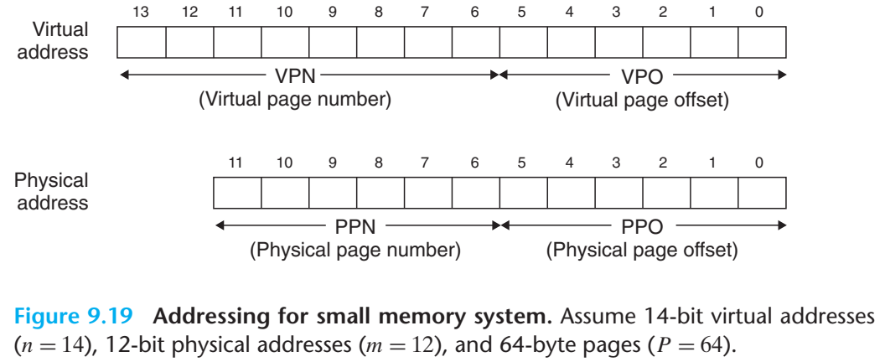

# 2022-12-04

## Computer System chapter9

### 6.1Cache와 VM의 통합

- 대부분의 시스템은 SRAM에 접근하기 위해 물리 주소 지정을 선택
  - 가상 페이지로부터 블록을 공유하는 것이 단순
  - 접근 권한이 주소 번역 과정의 일부로 체크되어 캐시가 보호 이슈를 다룰 필요가 없어짐


- 캐시 참조 이전에 주소 번역
- PTE 또한 다른 데이터 워드와 마찬가지로 캐싱 가능


### 6.2 TLB를 사용한 주소 번역 속도의 개선

- TLB: translation lookaside buffer
  - 번역 참조 버퍼라고 불리는 작은 가상 주소 지정 캐시
  - 각 라인마다 하나의 PTE로 구성된 하나의 블록을 저장


- set 선택과 라인 매칭을 위해 가상 페이지 넘버에서 추출된 index필드와 tag필드
- TLB가 T=2<sup>t</sup>개의 집합을 가지면 VPN의 t개의 최소 중요 비트를 갖는 TLBI와 나머지 부분인 TLBT로 구성


TLB 적중 시 발생하는 단계들로, 모든 주소 번역 단계가 on-chip MMU에서 매우 빠르게 수행

> 1. CPU가 가상 주소 생성
>
> 2~3. MMU가 적절한 PTE를 TLB로부터 선입
>
> 4. MMU가 가상주소를 물리 주소로 번역하여 캐시/메인 메모리로 전송
> 5. 캐시/메인 메모리는 요청한 데이터 워드를 CPU로 리턴

TLB 미스시 위 그림(b)와 같이 MMY가 PTE를 L1캐시에서 선입하며 기존의 엔트리 대체 가능


### 6.3 다중 레벨 페이지 테이블

- 가상 주소 공간만 참조하는 경우에도 메모리에 항상 일정 용량의 페이지 테이블을 요구
- 페이지 테이블을 압축하는 보편적인 접근법은 페이지 테이블의 계층 구조를 사용하는 것


가상 주소 공간에 대해 2단 페이지 테이블 계층 구조를 구성하는 방법

> level1 테이블의 각 PTE는 4M의 가상 주소 공간 크기를 매핑
> 각 블록은 1,024개의 연속적인 페이지로 구성
>
> i번째 블록의 모든 페이지가 할당되지 않은 상태라면 level1의 PTE i는 null
>
> level2의 PT내 각 PTE는 4KB VMP를 관리하며 단일 레벨 페이지 테이블과 동일
> 4byte PTE라면 각 페이지 테이블은 4KB이고 페이지와 같은 크기

- 메모리 요구량을 줄이는 두 가지 방법
  1. level1의 PTE가 null이면 level2 페이지 테이블이 불필요
  2. 메인 메모리에 level1 테이블만 항상 존재할 필요
     - level2 테이블은 VM 시스템에 의해 인 아웃 가능


k단계의 페이지 테이블 계층구조로 주소를 번역하는 방법

> k개의 PTE에 접근해야 하는 방식은 비실용적으로 보이나, 다른 레벨의 페이지 테이블에서 PTE를 캐싱하는 방법을 통해 TLB 활용이 수월해진다. 실제로 또한 단일 레벨 페이지 테이블에 비해 많이 느려지는 것도 아니다.


### 6.4 End-to-End Address Translation

> 해당 절 내 가정
>
> - 메모리는 바이트 주소 지정이 가능
> - 메모리 접근은 1바이트로 구성(4바이트 워드 X)
> - 가상 주소는 14비트 폭, 물리 주소는 12비트 폭을 가짐
> - 페이지 크기는 64바이트
> - TLB는 모두 16개의 엔트리를 갖는 4중 집합 결합도
> - L1 d-캐시는 물리 주소를 가지며 직접매핑을 사용하고 4바이트 라인 길이, 16개의 전체 집합을 가



가상 및 물리 주소의 하위 6비트는 VPO와 PPO로 각각 사용되며 가상 주소는 상위 8비트,
물리 주소는 상위 6비트를 VPN으로 사용


> - TLB
>   - VPN의 비트를 사용한 가상 주소 지정
>   - 네 개의 집합을 가지므로 VPN 2개 하위 비트들은 집합 인덱스로 이용되며
>     나머지 6개의 상위 비트들은 태그로 사용됨
> - 페이지 테이블
>   - 총 2<sup>8</sup> = 256개의 PTE를 갖는 단일 레벨 디자인
>   - 편의상 각 PTE를 이들을 인덱싱하는 VPN을 사용해 이름을 붙였으나, 해당 VPN들은 페이지 테이블에 들어있지 않으며 메모리에 저장되지 않음
>   - 각각의 유효하지 않은 PTE들은 "-"를 사용해 표시하며 어떤 비트를 가져도 아무 의미가 없음
> - 캐시
>   - direct-mapped 캐시는 물리 주소의 필드들로 주소를 지정
>   - 각 블록이 4KB이므로 물리 주소의 하위 2bits는 블록 오프셋(CO)로 사용
>   - 16개의 집합이 있으므로 다음 4비트는 집합 인덱스(CI)로 사용되며 나머지 6비트는 태그(CT)로 사용


### 9. 동적 메모리 할당

- 추가적인 가상 메모리를 런타임 중 획득할 필요가 있을 때 dynamic memory allocato를 사용하는 것이 편리
- 동적 메모리 할당기는 가상 메모리의 힙 영역을 관리
- 힙은 초기화되지 않은 메모리 영역 직후에서 높은 주소 방향으로 커지는 영역
- 커널은 힙의 꼭대기를 **brk**(break)라는 변수로 표기

- 동적 메모리 할당기는 힙을 다양한 크기의 블록 집합으로 관리
- 각 블록은 할당되었거나 사용 가능한 가상 메모리의 연속적인 묶음
- 가용(free)한 블록은 할당을 위해 사용할 수 있으며 명시적으로 할당할 때 까지 가용
- 할당된 블록은 명시적으로 혹은 묵시적으로 반환될 때까지 할당


> **명시적 할당기**(Explicit allocators)
>
> - 어플리케이션에 할당된 블록들에 대해 명시적으로 반환을 요구하는 할당기
> - C 표준 라이브러리에서는 malloc 패키지와 같은 명시적 할당기를 제공
>
> **묵시적 할당기**(Implicit allocators)
>
> - 할당된 블록이 언제 더 이상 사용되지 않는 지 검출할 방법을 요구
> - garbage collector로 알려진 묵시적 할당기는 자동으로 사용하지 않은 할당 블록을 반환


### 9.1 `malloc`과 `free` 함수

- C 표준 라이브러리인 malloc 패키지에서 명시적 할당기를 제공
- `malloc`함수를 호출해서 힙으로부터 블록들을 할당

```c
#include <unistd.h>

void*malloc(size_t size);

returns: pointer to allocated block if OK, NULL on error
```

- 블록 내 포함될 수 있는 데이터 객체에 대해 정절한 최소 size byte 메모리 블록의 포인터를 리턴
- 32비트에서는 8의 배수 블록, 64비트에서는 16배수 블록 주소를 리턴
- 가용한 메모리 이상을 요구하는 등의 문제를 만나면 NULL을 리턴하고 errno를 설정
- `calloc`: `malloc`과 달리 0으로 동적 메모리를 초기화하여 포인터를 리턴하는 함수
- `realloc`: 이전에 할당된 블록의 크기를 변경하는 함수
- malloc과 같은 동적 메모리 할당기는 `mmap`과 `munmap`함수를 사용해서 명시적으로
  힙 메모리를 할당하거나 반환할 수 있으며 `sbrk`함수를 사용

```c
#include <unistd.h>

void *sbrk(intptr_t incr);

returns: old brk pointer on success, -1 on error
```

- `sbrk`는 커널의 `brk`포인터에 `incr`을 더해서 힙을 늘리거나 줄이는 함수
- 성공한다면 이전의 `brk`값을 리턴하고 아니면 -1을 리턴하며 `errno`를 ENOMEM으로 설정
- `incr`이 0이면 `sbrk`는 현재 `brk`값을 리턴
- `incr`에 음수를 사용할 수 있지만, 리턴 값인 `brk`이 새로운 힙의 탑보다 큰 바이트를 나타내므로 복잡


```C
#include <unistd.h>

void free(void * ptr);

returns: nothing
```

- 프로그램들은 할당된 힙 블록을 `free`함수를 호출해 반환
- `ptr` 인자는 `malloc`, `calloc`, `realloc`에서 반환한 할당 블록의 시작점

- 위 조건을 위배 시 `free`의 동작은 정의되지 않으며, 리턴 값이 없기 때문에 에러 반환이 불가


굵은 선은 할당된 블록, 색이 없는 블록은 가용 블록들을 의미

> 처음 힙은 각 박스당 4-byte 워드를 의미하며 싱글 16워드가 더블 워드 정렬된 가용 블록으로 구성
>
> a. 프로그램에서 4워드 블록을 요청하면 `malloc`은 가용 블록의 앞부분에서 4워드 블록을 잘라내고,
> 	이 블록의 첫번째 워드를 가리키는 포인터를 리턴
>
> b. 프로그램에서 5워드 블록을 요청할 경우 `malloc`은 6워드 블록을 할당
> 	이는 `malloc`이 가용 블록이 double-word 경계에 정렬되도록 하기 위하여 추가 워드를 패딩한 것
>
> c. 프로그램은 6워드 블록을 요청하고 `malloc`은 가용 블록에서 6워드 블록을 할당
>
> d. (b)에서 할당된 6워드 블록을 반환
> 	*`free`로의 호출이 리턴한 후에도 포인터 `p2`는 여전히 malloc된 블록을 가리키고 있음에 주의
> 	`p2`가 새로운 malloc 콜에 의해 다시 초기화 될 때까지 `p2`를 사용하지 않는 것은 사용자의 책임
>
> e. 프로그램이 2워드 블록을 요청하면 `malloc`은 이전 단계에서 반환된 블록의 부분을 할당하고
> 	새롭게 할당된 해당 블록의 포인터를 리턴


### 9.2 왜 동적 메모리 할당인가?

- 프로그램을 실행시킬 때 까지 자료 구조의 크기를 알 수 없는 경우가 발생
- MAX값을 할당한다고 가정했을 때
  - MAX값보다 더 큰 파일을 읽으려면 가능한 방법은 오직 더 큰 MAX값을 사용한 컴파일
- n값을 알 수 있을 때 런타임에 동적으로 할당하는 것이 합리적
  - 배열의 최대 크기는 가용한 가상 메모리의 양에 의해서만 제한
- 동적 메모리 할당은 유용하고 중요한 프로그래밍 기술이나,
  정확하고 효율적인 사용을 위해 동작 원리를 이해할 필요


### 9.3 할당기 요구사항과 목표

- 명시적 할당기는 엄격한 제한사항 내에서 동작할 필요

> 임의의 요청 순서 처리
>
> ​	할당기 내에서 할당과 반환에 대한 요청 순서에 대해 가정하지 않으며, allocate과 free 요청이
> ​	쌍을 이룬다는 가정이 불가능
>
> 요청에 즉각적인 응답
>
> ​	할당 요청에 즉시 응답해야 하므로 할당자에 의한 재정렬이나 버퍼 사용 불가
>
> 오직 힙만 사용
>
> ​	확장성을 갖기 위해 할당기가 사용하는 비확장성 자료구조들은 힙 자체에 저장
>
> 블록 정렬
>
> ​	할당기는 블록들을 어떤 종류의 데이터 객체라도 저장할 수 있도록 하는 방식으로 정렬

위와 같은 제한사항 내에서 할당기 개발자는 처리량과 메모리 이용도를 최대화하려는 목표를 가짐

- 목표 1: 처리량 극대화
  - 처리량은 단위 시간당 완료되는 요청의 수
    - 단위 시간당 처리된 할당 요청과 반환 요청의 합
- 목표 2: 메모리 이용도 최대화
  - 한 시스템에서 할당된 가상 메모리의 양은 디스크 내의 스왑 공간에 의에 제한
  - 가상 메모리 또한 효율성이 중요한 유한한 자원이므로 힙을 효율적으로 사용할 필요
    - 최고 이용도
      
      - 요청 R<sub>k</sub>가 완료된 후 종합 데이터 P<sub>k</sub>는 현재 할당 블록 데이터들의 합
      - H<sub>k</sub>는 현재 힙의 크기
      - 할당기의 목적은 최고 이용도 U<sub>n-1</sub>을 전체 배열에 대해 극대화하는 것
  - 힙 이용도를 포기하고 처리량을 최대화하는 할당기의 작성은 쉬우며
    흥미로운 도전 중 하나는 두 목표 간의 적절한 균형을 맞추는 것


### 9.4 단편화

- 단편화(fragmentation): 나쁜 힙 이용도의 주요 이유로 알려진 현상
- 가용 메모리가 할당 요청을 만족시키기에는 불가능할 때 발생
- 두 가지 단편화가 존재
  - 내부 단편화
    - 할당된 블록이 데이터 자체보다 더 클 때 발생
    - 할당기에서 정렬 제한 사항을 위해 크기를 늘리는 상황 등에서 발생
    - 단순히 할당된 블럭과 데이터 양의 차이이므로 정량화 하기 간단하고 
      시간상 어디서든 내부 단편화의 양은 이전 요청 패턴과 할당기 구현에 따름
  - 외부 단편화
    - 남은 가용 블록을 전부 모으면 할당 요청을 만족할 수 있지만, 단일 가용 블록이 없는 경우
    - 시점상 미래의 할당 요청 패턴에 달려있기 때문에 예측이 어려움
    - 측정의 어려움과 예측 불가능함 때문에 할당기들은 작고 많은 수의 가용블록 보다는
      적은 수의 더 큰 가용블록을 유지하려는 방법을 채택


### 9.5 구현 이슈

- `malloc`과 `free`와 같은 함수들은 적은 수의 명령어를 실행하므로 높은 처리량을 가짐
- 그러나 블록들을 재사용하지 않기 때문에 메모리 이용도는 나쁠 것

> 처리량과 이용도 사이 균형을 가지고자 고려해야할 이슈
>
> 가용 블록 구성
> 	가용 블록 지속적 추적 방법
>
> 배치
> 	새롭게 할당된 블록을 배치하기 위한 가용 블록 선택 방식
>
> 분할
> 	가용블록을 배치한 후 나머지 부분에 대한 처리
>
> 연결
> 	반환된 블록으로 수행할 행동


### 9.6 묵시적 가용 리스트

**implicit free lists*

실용적인 할당기도 블록 경계를 구분하고 할당 블록과 가용 블록을 구별하는 자료구조를 필요로 한다.

- 대부분의 할당기는 해당 정보를 블록 내에 내장


위 경우 한 블록은 1워드 헤더, 데이터, 추가적인 패딩으로 구성되며 헤더에서 블록 크기와 블록 할당 여부 인코딩

- 더블 워드 정렬 제한 조건이 있다면 블록 크기는 항상 8의 배수가 되며 블록 크기의 하위 3비트는 항상 0
- 데이터 다음의 패딩의 크기는 가변적
- 패딩은 외부 단편화를 극복하기 위한 할당기의 전략으로 사용 가능


- 힙을 연속된 할당 및 가용 블록의 배열로 구성
- 묵시적 리스트(impoicit lsit)
  - 가용 블록이 헤더 내 필드에 의해 묵시적으로 연결
  - 가용 블록 전체 집합을 힙 내의 전체 블록을 다니면서 방문
  - 표시 가능한 마지막 블록이 필요하다는 점에 유의
    - 예시에서는 종료 헤더에 할당 비트는 세트되어 있고 크기는 0
  - 단순성에 장점이 있으나 가용 리스트를 탐색해야 하는 연산들의 비용이 힙에 있는 할당 및 가용 블록의 수에 비례하는 단점이 존재
- 시스템의 정렬 요구조건과 할당기의 블록 포맷 선택이 최소 블록 크기를 결정하며
  할당되거나 반환된 모든 블록은 이 최소값보다 더 작을 수 없음


 ### 9.7 할당 블록의 배치

k바이트의 블록을 요청할 때, 할당기는 요청한 블록을 저장하기에 충분히 큰 가용 블록을 리스트에서 검색

- 할당기가 검색을 수행하는 방법은 배치 정책에 의해서 결정
  - *first fit*
    - free 리스트를 처음부터 검색해서 크기가 맞는 첫 번째 가용 블록을 선택
    - 리스트의 마지막에 큰 가용 블록들을 남겨두는 장점이 있지만 리스트 앞 부분에 작은 가용 블록들을 남겨두어 큰 블록을 찾는 경우 검색 시간이 늘어나는 단점
  - *next fit*
    - 검색이 종료된 지점에서 검색을 시작하여 크기가 맞는 첫 가용 블록을 선택
    - *first fit*에 대한 대안으로 제안되었으며 이전 검색에서 찾은 가용 블록의 나머지 부분에서 검색할
      가능성이 높다는 아이디어에서 착안
    - 리스트 앞이 많은 작은 크기의 조각들로 구성될수록 *first fit*에 비해 매우 빠른 속도를 보이나
      일부 경우에서 *first fit*보다 나쁜 메모리 이용도를 갖는 것으로 평가
  - *best fit*(↔ *worst fit*)
    - 모든 가용 블록 중 크기가 맞는 가장 작은 블록을 선택
    - 더 좋은 메모리 이용도를 가지나 힙을 완전히 다 검색해야된다는 단점이 존재
    - 힙을 모두 검색하지 않는 segregated free list


### 9.8 가용 블록의 분할

- 크기가 맞는 가용 블록을 찾은 후에 가용 블록의 어느 정도를 할당할지에 대한 정책적 결정
- 빠르고 간편한 방법은 해당 가용 블록을 모두 사용하는 것이지만, 큰 내부 단편화가 발생 가능성
  - 배치 정책으로 크기가 잘 맞는다면 어느 정도 내부 단편화는 수용 가능


- 일반적으로 크기가 맞지 않는 블록에 대해 할당기는 블록을 첫 부분은 할당한 블록,
  나머지 부분은 새로운 가용블록 두 부분으로 분할


### 9.9 추가적인 힙 메모리 획득

할당기가 요청한 블록을 찾을 수 없는 경우

- 물리적으로 인접한 가용 불록들을 연결하여 더 큰 가용 블록을 생성
- 위 방법으로도 불가능하거나 이미 가용 블록이 최대로 연결된 경우
  - allocator가 커널에 `sork`함수를 호출하여 추가적인 힙 메모리를 요청
  - 할당기는 추가 메모리를 한 개의 더 큰 가용블록으로 변환하여 가용 리스트에 삽입핸 후 요청 블록을 배치


### 9.10 가용 블록 연결하기

 새롭게 반환하는 블록에 인접한 다른 가용 블록들이 오류 단편화(*false fragmentation*)라는 현상을 유발할 수 있음


- 오류 단편화 현상이 유발되면 작고 사용할 수 없는 가용 블록으로 쪼개진 많은 가용 메모리들이 존재
- 위 경우에서 4워드를 요청하면 두 가용 블록의 크기가 충분히 큼에도 실패
  - 실용적인 할당기는 연결(coalescing)과정을 통해 인접 가용 블록을 통합
  - 연결 과정을 수행할 시점에 대한 중요한 정책 결정이 필요
  - 즉시 연결(*Immediate Coalescing*)
    - 블록이 반환될 때마다 인접 블록을 통합하는 연결 방법
    - 간단하며 상수 시간 내에 수행가능하나 일부 요청 패턴에 대해 스래싱을 유발
  - 지연 연결(*deferred coalescing*)
    - 일정 시간 후에 가용 블록들을 연결하기 위해 기다리는 연결 방법


### 9.11 Coalescing with boundary tags

> 할당기가 연결을 구현하는 방법
>
> 반환하려는 블록을 current block이라 가정하면 다음 가용 블록을 연결하는 것이 쉽고 효율적
> 현재 블록의 헤더가 다음 블록의 헤더를 가리키며 가용한지 체크하면 그 크기가 단순히 현재 헤더에
> 더해지므로 블록은 상수 시간 내에 연결 가능
>
> 그러나 이전 블록의 연결에 어려움이 존재


- 묵시적 가용 리스트에서는 현재 블록에 도달할 때까지
  전체 리스트를 검색해서 이전 블록의 위치를 기억하는 것을 통해 이전 블록이 가용상태인지 확인
- 위 경우는 `free`의 호출이 힙의 크기에 비례하는 시간을 소모하도록 만듦

 

- 위 방법은 각 블록의 끝 부분에 *header*를 복사한 *footer*를 포함
- 풋터를 통해 자신의 헤드 위치 및 이전 블록의 풋터와 시작점을 추정

> 현재 블록을 반환할 때 가능한 모든 경우
>
> 1. 이전과 다음 블록 모두 할당
> 2. 이전 블록은 할당, 다음 블록은 가용
> 3. 이전 블록은 가용, 다음 블록은 할당
> 4. 이전 블록과 다음 블록 모두 가용


> Case1
>
> ​	인접 블록이 모두 할당 상태이므로 현재 블록의 상태만 할당에서 가용으로 변경
>
> Case2
>
> ​	현재 블록이 다음 블록과 통합되며 현재 블록의 헤더와 다음 블록의 풋터가 크기를 합한 값으로 갱신
>
> Case3
>
> ​	이전 블록과 연결되며 이전 블록의 헤더와 현재 블록의 풋터가 갱신
>
> Case4
>
> ​	이전 블록과 다음블록이 모두 연결되며 이전 블록의 헤더와 다음 블록의 풋터가 갱신

각 경우는 상수 시간이 필요

- boundary tag 아이디어는 간단하고 좋은 개념이지만, 각 블록이 헤더와 풋터를 유지해야되므로
  프로그램이 많고 작은 블록을 다룬다면 메모리 오버헤드가 발생할 가능성 존재
  - 이전 블록이 가용한 경우에만 풋터가 필요하다는 점을 이용
